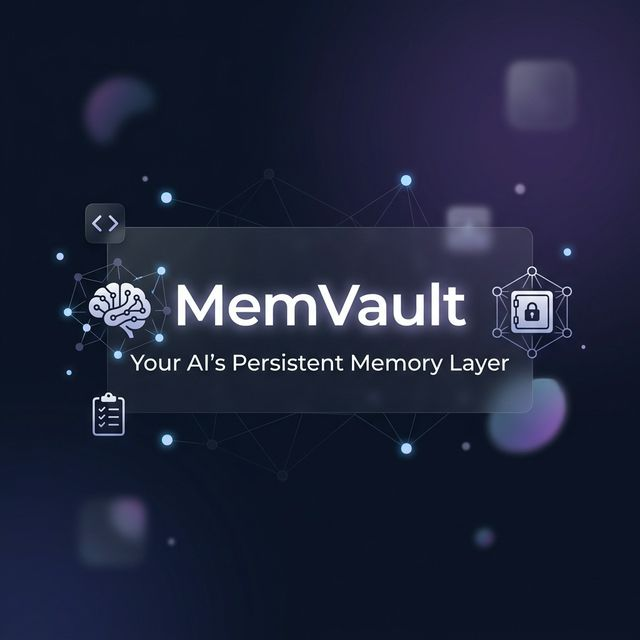
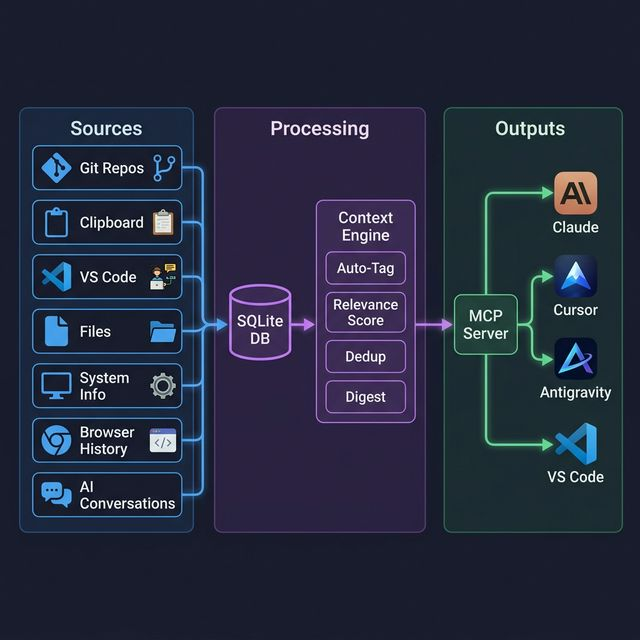
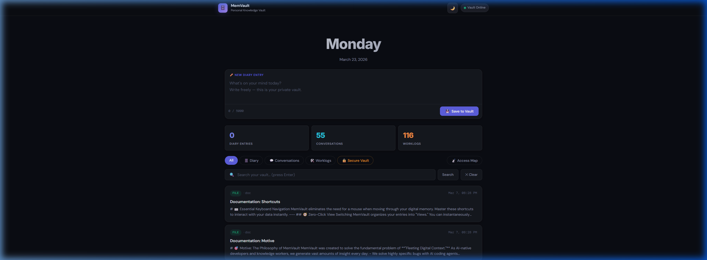

<p align="center">
  
</p>

<p align="center">
  A self-hosted MCP server that gives Claude, Cursor, and every AI tool<br>
  persistent memory about <em>you</em> -- your code, projects, habits, and preferences.
</p>

<p align="center">
  Built by <a href="https://github.com/MrChartist"><strong>Mr. Chartist</strong></a> | Part of the <a href="https://mrchartist.com">Mr. Chartist Ecosystem</a>
</p>

<p align="center">
  <a href="#-quick-start"></a>
  <a href="https://github.com/MrChartist/memvault/blob/main/LICENSE"></a>
  <a href="#-mcp-integration"></a>
  
</p>

---

## 🤔 What is MemVault?

Every time you start a new AI conversation, your assistant forgets everything. **MemVault fixes that.**

It silently captures your digital footprint — Git commits, VS Code projects, clipboard content, file changes, system info, browser history, and AI conversations — then serves this context to **any AI tool** via the [Model Context Protocol (MCP)](https://modelcontextprotocol.io).

> **Think of it as a second brain for your AI assistants.**

### The Problem

```
You:    "Fix the login bug we discussed yesterday"
AI:     "I don't have any context about previous conversations..."
```

### With MemVault

```
You:    "Fix the login bug we discussed yesterday"
AI:     (queries MemVault) → finds yesterday's conversation, related commits, and file changes
AI:     "I found 3 relevant entries. The auth bug was in middleware/session.js..."
```

---

## ✨ Features

<table>
<tr>
<td width="50%">

### 🧠 20 MCP Tools
Your AI gets superpowers:
- **`vault_smart_search`** — Intent-driven semantic search
- **`vault_smart_context`** — Relevance-ranked results
- **`vault_capture_prompt`** — Auto-logs every prompt to any AI tool
- **`vault_project_context`** — Full project intelligence
- ...and 16 more tools

</td>
<td width="50%">

### 🕸️ 7 Data Capture Engines + 4 AI Importers  
Reads everything from your computer:
- 📦 **Git commits** from all local repos
- 💻 **VS Code** projects, extensions, settings
- 📋 **Clipboard** history (with classification)
- 📁 **File changes** across project directories
- 🖥️ **System info** (OS, RAM, CPU, dev tools)
- 🌐 **Browser** history (Chrome/Edge)
- 🤖 **AI conversations** (Antigravity & Universal Importers)

</td>
</tr>
</table>

### 🏗️ Architecture

<p align="center">
  
</p>

### 🎨 Beautiful Web UI

<p align="center">
  
</p>

A sleek dark-mode dashboard with:
- 📔 Diary entry writer  
- 🔍 Full-text search across all entries  
- 📊 Vault statistics  
- 🔐 Encrypted secrets manager  
- 🗺️ Access map visualization  

---

## 🚀 Quick Start

### Prerequisites

- **Node.js** 18+ ([download](https://nodejs.org))
- **Git** (for sync-git)

### Installation

```bash
# Clone the repository
git clone https://github.com/MrChartist/memvault.git
cd memvault

# Install dependencies
npm install

# Run the setup wizard
node init.mjs
```

The wizard will ask you:
1. Where to store your vault data
2. Which capture engines to enable
3. Show you the MCP config for your AI clients

### Start the Server

```bash
# Start the web UI + API server
npm start

# Open the dashboard
# → http://localhost:7799
```

### Sync Your Data

```bash
# Sync everything at once
npm run sync:all

# Or sync individually
npm run sync:git         # Git commit history
npm run sync:vscode      # VS Code projects & extensions
npm run sync:system      # System information snapshot
npm run sync:files       # Recently modified files
```

---

## 🔌 MCP Integration

MemVault speaks the [Model Context Protocol](https://modelcontextprotocol.io) — the universal standard for connecting AI tools to data sources.

### Claude Desktop

Add to `claude_desktop_config.json`:

```json
{
  "mcpServers": {
    "memvault": {
      "command": "node",
      "args": ["/path/to/memvault/mcp-server.mjs"],
      "env": { "VAULT_ROOT": "/path/to/your/vault/data" }
    }
  }
}
```

### Cursor

In Cursor Settings → Features → MCP Servers, add:

```json
{
  "mcpServers": {
    "memvault": {
      "command": "node",
      "args": ["/path/to/memvault/mcp-server.mjs"],
      "env": { "VAULT_ROOT": "/path/to/your/vault/data" }
    }
  }
}
```

### VS Code (Cline / Roo Code)

Add to your MCP settings file:

```json
{
  "mcpServers": {
    "memvault": {
      "command": "node",
      "args": ["/path/to/memvault/mcp-server.mjs"],
      "env": { "VAULT_ROOT": "/path/to/your/vault/data" }
    }
  }
}
```

### Antigravity

Add to `~/.gemini/antigravity/mcp_config.json`:

```json
{
  "mcpServers": {
    "memvault": {
      "command": "node",
      "args": ["/path/to/memvault/mcp-server.mjs"],
      "env": { "VAULT_ROOT": "/path/to/your/vault/data" }
    }
  }
}
```

> **💡 Tip:** Replace `/path/to/memvault` and `/path/to/your/vault/data` with your actual paths. On Windows, use forward slashes in JSON: `"D:/projects/memvault/mcp-server.mjs"`.

---

## 🛠️ All 20 MCP Tools

### Phase 5B: AI Intelligence Layer (Gemini-Powered)

| Tool | Category | Description |
|------|----------|-------------|
| `vault_capture_prompt` | 🧠 AI | Auto-logs every prompt you send to ANY AI |
| `vault_log_conversation` | 🧠 AI | Saves conversation summaries to vault |
| `vault_ai_summarize` | 🧠 AI | AI-powered entry summarization (Gemini) |
| `vault_ai_insights` | 🧠 AI | Pattern & productivity insights |
| `vault_smart_search` | 🧠 AI | Semantic search with AI re-ranking |
| `vault_weekly_digest` | 🧠 AI | AI-generated weekly activity digest |

### Phase 1-3: Core & Smart Context

| Tool | Category | Description |
|------|----------|-------------|
| `vault_smart_context` | 💡 Context | **Best core tool.** Relevance-ranked, auto-tagged, deduplicated context |
| `vault_project_context` | 💡 Context | Full background on a specific project — tech stack, timeline, activity |
| `vault_daily_digest` | 💡 Context | Auto-generated summary of the day's activity |
| `vault_remember` | 💡 Context | AI proactively saves facts, decisions, preferences for future sessions |
| `vault_git_log` | 📦 Data | Recent Git commits across all tracked repositories |
| `vault_recent_files` | 📦 Data | Files modified recently, grouped by project |
| `vault_system_info` | 📦 Data | OS, hardware, dev tools versions, running processes |
| `vault_projects` | 📦 Data | VS Code recent workspaces and installed extensions |
| `vault_search` | 🔧 Core | Full-text search across all vault entries |
| `vault_add` | 🔧 Core | Add diary, worklog, or conversation entries |
| `vault_list` | 🔧 Core | List recent entries by type |
| `vault_get_context` | 🔧 Core | Get vault context for a topic |
| `vault_stats` | 🔧 Core | Vault statistics — entry counts by type, storage info |
| `vault_secret_list` | 🔧 Core | List encrypted secret labels (no values exposed) |

### Smart Context Engine

The intelligence layer that makes entries useful:

| Feature | How It Works |
|---------|-------------|
| **Auto-Tagging** | 30+ regex patterns detect `react`, `python`, `trading`, `bugfix`, etc. |
| **Relevance Scoring** | Combines keyword match strength + recency bonus for precision results |
| **Project Detection** | Auto-recognizes your projects by name and context |
| **Deduplication** | Jaccard similarity filters duplicate entries across data sources |
| **Session Memory** | Tracks what the AI already saw — avoids repeating context |
| **Daily Digest** | Aggregates your day's activity with project + tech stack breakdown |

### 🤖 AI Data Importers (Phase 5A)

MemVault natively understands data exports from major AI platforms. Import your entire chat history with one command:

```bash
memvault import ./chatgpt-export/
memvault import ./claude-export/
memvault import ./google-takeout/
memvault import ./perplexity-export/
```

---

## 📁 Project Structure

```
memvault/
├── mcp-server.mjs         # MCP server (20 tools, 5 resources, 3 prompts)
├── ai-engine.mjs          # Gemini API intelligence (summarization, insights, search)
├── context-engine.mjs     # Smart context: auto-tag, score, dedup, digest
├── server.mjs             # Express API + web UI server
├── config.mjs             # Centralized configuration (~/.memvaultrc.json)
├── cli.mjs                # CLI entry point (npx memvault <cmd>)
├── init.mjs               # Interactive setup wizard
│
├── import-all.mjs         # Universal AI conversation importer
├── import-chatgpt.mjs     # ChatGPT import logic
├── import-claude.mjs      # Claude import logic
├── import-gemini.mjs      # Gemini import logic
├── import-perplexity.mjs  # Perplexity import logic
│
├── sync-git.mjs           # Git commit capture
├── sync-clipboard.mjs     # Clipboard content capture
├── sync-vscode.mjs        # VS Code activity capture
├── sync-files.mjs         # File change capture
├── sync-system.mjs        # System info capture
├── sync-browser.mjs       # Browser history capture
├── sync-antigravity.mjs   # AI conversation capture
├── sync-all.mjs           # Run all sync engines
│
├── vault.mjs              # CLI tool (add/search entries)
├── public/                # Web UI assets (HTML/CSS/JS)
├── docs/images/           # README screenshots & diagrams
└── package.json
```

---

## ⚙️ Configuration

MemVault uses `~/.memvaultrc.json` for per-user settings. Run `node init.mjs` to create it interactively, or create manually:

```json
{
  "vaultRoot": "~/.memvault/data",
  "port": 7799,
  "sync": {
    "gitDirs": ["/home/you/projects"],
    "vscodeEnabled": true,
    "systemEnabled": true,
    "filesEnabled": true,
    "clipboardEnabled": false,
    "browserEnabled": true
  },
  "ai": {
    "enabled": true,
    "apiKey": "YOUR_GEMINI_API_KEY",
    "model": "gemini-2.0-flash"
  }
}
```

### Environment Variables

| Variable | Default | Description |
|----------|---------|-------------|
| `VAULT_ROOT` | `~/.memvault/data` | Where vault data is stored |
| `PORT` | `7799` | API server port |

---

## 🔒 Security

MemVault is **local-first** and **privacy-focused**:

- ⚡ **stdio transport** — MCP communicates via stdin/stdout, never over the network
- 🔐 **Encrypted secrets** — API keys and passwords are AES-256-GCM encrypted
- 🏠 **No cloud** — All data stays on your machine, in your SQLite database
- 🚫 **No telemetry** — Zero analytics, zero tracking, zero network calls
- 📋 **Clipboard opt-in** — Clipboard capture is disabled by default

---

## 🧰 CLI Commands

```bash
# Setup
node init.mjs              # Interactive setup wizard

# Server
npm start                   # Start API + web UI (http://localhost:7799)
npm run mcp                 # Start MCP server (stdio)
npm run dev                 # Dev mode with auto-reload

# Sync engines
npm run sync:all            # Run all sync engines
npm run sync:git            # Sync Git commits
npm run sync:vscode         # Sync VS Code data
npm run sync:system         # Capture system snapshot
npm run sync:files          # Scan recent file changes
npm run sync:clipboard      # Start clipboard daemon

# CLI vault
node vault.mjs diary "Today I shipped the new auth system"
node vault.mjs worklog "Fixed CORS headers in API server"
```

---

## 🗺️ Roadmap

- [x] **Phase 1** — Core MCP Server (14 tools, 5 resources, 3 prompts)
- [x] **Phase 2** — Universal Data Capture (7 sync engines)
- [x] **Phase 3** — Smart Context Engine (auto-tag, relevance, dedup, memory)
- [x] **Phase 4** — CLI Wizard & Configuration
- [x] **Phase 5** — AI Intelligence (Gemini + Importers for ChatGPT, Claude, Gemini, Perplexity)
- [x] **Phase 6** — Auto-start on boot (Native Windows VBS in Startup + SchTasks)
- [ ] **Phase 7** — Ollama integration for local AI summarization

---

## 🤝 Contributing

Contributions are welcome! Please:

1. Fork the repository
2. Create a feature branch (`git checkout -b feature/cool-thing`)
3. Commit your changes (`git commit -m 'Add cool thing'`)
4. Push to the branch (`git push origin feature/cool-thing`)
5. Open a Pull Request

---

## 📄 License

MIT © [Rohit](https://github.com/MrChartist)

---

<p align="center">
  <b>Made with care by <a href="https://github.com/MrChartist">Mr. Chartist</a></b><br>
  <i>Built for developers who want their AI to actually understand them.</i><br><br>
  <a href="https://mrchartist.com"></a>
  <a href="https://github.com/MrChartist"></a>
</p>


