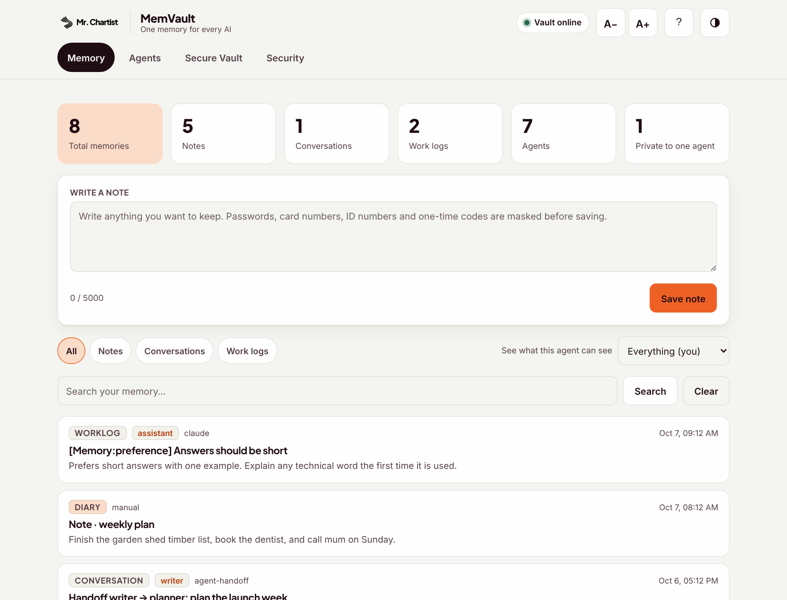
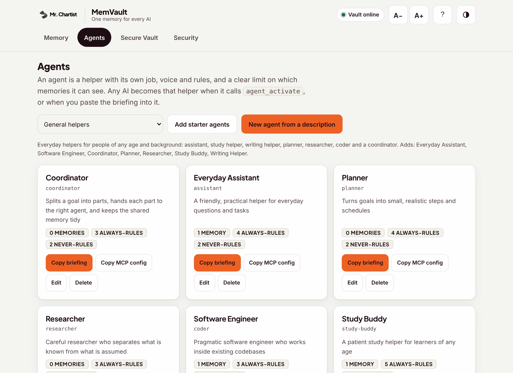

<p align="center">
  <picture>
    <source media="(prefers-color-scheme: dark)" srcset="public/brand/logo-horizontal-white.svg">
    
  </picture>
</p>

<h1 align="center">MemVault</h1>

<p align="center"><strong>One private memory, on your own computer, shared by every AI you use.</strong><br>
Tell one AI something once. Every other AI can find it too.</p>

<p align="center">
  <a href="LICENSE"></a>
  
  
  
</p>

<p align="center"></p>

---

## What is MemVault?

Every AI assistant starts each chat with an empty head. You explain who you are, what you are working on, and how you like answers, and then you do it all again in the next app.

MemVault is a notebook that lives **on your own computer**. Your AI apps (Claude, Cursor, Antigravity, VS Code, and any app that supports [MCP](https://modelcontextprotocol.io)) can read it and write to it. So:

```
You, in Claude:   "Remember that I prefer short answers with one example."
You, in Cursor:   "Help me write this email."
Cursor:           (looks in MemVault) "Here is a short draft with one example..."
```

It also lets you give each AI its own **agent**: a helper with a job, a voice, rules, and a clear limit on which memories it may see. A study helper does not need to see your work notes.

**Who is it for?** Anyone who uses more than one AI assistant: students, writers, developers, researchers, and anyone who is tired of repeating themselves.

## Get started

> **Honest note before you start.** MemVault needs [Node.js](https://nodejs.org) and a few commands in a terminal today. A one-click installer is planned (see [ROADMAP.md](ROADMAP.md)) but does not exist yet. It has been built and tested on Linux. The tests, an install check and the dashboard browser tests also pass on Windows and macOS in CI, but nobody has used it on those systems by hand yet, so expect rough edges there and please [tell us](https://github.com/MrChartist/memvault/issues).

You need Node.js 20 or newer (choose the "LTS" download). Then, in a terminal:

```bash
npx @mrchartist/memvault setup        # one step, no questions
npx @mrchartist/memvault mcp-config   # prints what to paste into your AI app
npx @mrchartist/memvault open         # opens the dashboard
```

<details>
<summary>Installing from the source code instead</summary>

```bash
git clone https://github.com/MrChartist/memvault.git
cd memvault
npm install
node cli.mjs setup
node cli.mjs mcp-config
node cli.mjs open
```
After that, use `node cli.mjs` wherever this page says `memvault`.
</details>

The dashboard's **Get started** card walks you through connecting an app. Or run `memvault mcp-config` and paste the result into your app's MCP settings:

| App | Usually found in |
|-----|------------------|
| Claude Desktop | `claude_desktop_config.json` (Settings → Developer → Edit Config) |
| Cursor | `~/.cursor/mcp.json` |
| Claude Code | run the `claude mcp add …` command the dashboard shows you |
| Antigravity | `~/.gemini/antigravity/mcp_config.json` |
| VS Code (Cline, Roo) | the extension's MCP settings file |

Menus and file locations change between versions. If something looks different, search that app's help for "MCP servers".

Then try it. In your AI app, say: **"Remember that I prefer short answers."**

**In the dashboard** you can write notes, search, open any memory in full, correct it, pin it, download it or delete it (with **Undo**, and a typed confirmation when you delete several at once). The **Settings** screen lets you switch automatic saving on or off, set a backup passphrase, add your projects, download everything and see what you deleted recently, all without the terminal.

## Agents: helpers with their own job and their own view

An agent is a saved profile. It says who the helper is, how it should sound, what it must always and never do, and which memories it can see. Any AI becomes that helper by calling `agent_activate`.

| Starter helper | What it is for |
|---|---|
| Everyday Assistant | Plain-language help with questions and small jobs |
| Study Buddy | Explains step by step, lets the learner try first |
| Writing Helper | Plans and edits while keeping your own voice |
| Planner | Turns goals into small, realistic steps |
| Researcher | Separates what is known from what is assumed |
| Software Engineer | Small, tested changes that match your code |
| Coordinator | Splits a goal and hands each part to the right helper |

`memvault agent packs` lists more starter sets. Make your own in the dashboard by describing the helper in your own words, or with `memvault agent create --from-file my-helper.txt --save`.

<p align="center"></p>

**Memory spaces.** Every note lives in one space:

| Space | Who can read it |
|---|---|
| `shared` | every agent (the common memory) |
| `agent:<name>` | only that agent (and you) |
| `project:<name>` | agents you allow, for one project |

**Handoffs.** One agent can leave work for another (`agent_handoff`). The other finds it in its inbox the next time it starts (`agent_inbox`). They share memory, not chat history, so a brief must say everything the next helper needs.

**Giving an AI app its own agent.** `memvault mcp-config --agent study-buddy` prints settings that bind that app to one agent. The agent is chosen by that setting, never by anything the AI says, so an AI cannot give itself more access. Full guide: [docs/agents.md](docs/agents.md).

## Is it safe?

MemVault is built so that your data stays with you, and it can check itself: run `memvault doctor` for a live report, or open the **Security** page in the dashboard.

| What | How |
|---|---|
| Nothing is reachable from outside this computer | The server listens on `127.0.0.1` only. Every request needs a secret key, and web pages from other sites are refused. |
| Passwords and ID numbers are hidden before saving | Common API keys and tokens, passwords in many formats (`password=…`, JSON, `.env`, web addresses, `curl -u`), card numbers, one-time codes and national ID numbers (US, UK, Canada, EU/IBAN, India) are replaced with a marker before saving. This includes the clipboard. It is pattern matching: unusual formats are missed. |
| Each AI sees only what it should | Agents read through a filtered copy of the memory. Other agents' private notes are not just hidden; they are not in that copy at all. An agent can only become itself, and a message "from" another agent cannot be forged by typing tags. |
| Your secrets are locked | The Secure Vault uses AES-256 with a key made from your master password. Agents never receive secret values. **There is no way to recover a forgotten master password.** |
| Cloud backups are encrypted first | Without your passphrase, a cloud backup refuses to run. It never uploads plain text by default. You can set the passphrase in **Settings**. |
| You can see who used your memory | A tamper-evident log records which agent called what, and when. It never records the content. |
| Automatic capture is opt-in | Git, files, browser, computer info, VS Code and clipboard capture are all off until you turn them on in Settings. Running a capture script directly does nothing unless it is on (or you add `--force`). |
| Deleting really deletes | Deleting a memory also removes its readable Markdown copy. Backups you made earlier still contain it. |
| No tracking | No analytics, no telemetry, and the dashboard makes no requests to other websites. |

**What no tool can promise.** When you ask an AI app to look something up in MemVault, the text it reads is sent to the company behind that AI, just like anything you type to it. Agents limit how much each AI can see; they cannot change that. Masking is a safety net that catches common patterns, not a guarantee. Malware running as your own user account can read your files. Turn on your system's disk encryption (BitLocker, FileVault, or LUKS) to protect a lost laptop. The full, honest list is in [SECURITY.md](SECURITY.md).

## What your AI can do with it

29 tools, offered to your AI automatically. An agent bound to one profile is offered only the tools it may use (about 23 by default, fewer if you restrict it), which also keeps each chat lighter.

| Group | Tools |
|---|---|
| Remember and find | `vault_remember`, `vault_add`, `vault_search`, `vault_smart_search`, `vault_smart_context`, `vault_get_context`, `vault_list`, `vault_stats` |
| Summaries | `vault_project_context`, `vault_daily_digest`, `vault_weekly_digest`, `vault_projects` |
| Captured data | `vault_git_log`, `vault_recent_files`, `vault_system_info` |
| Conversation logs | `vault_capture_prompt`, `vault_log_conversation` |
| Agents | `agent_list`, `agent_activate`, `agent_define`, `agent_handoff`, `agent_inbox` |
| With your own Gemini key (optional) | `vault_ai_summarize`, `vault_ai_insights` |
| Owner only | `vault_backup`, `vault_backups`, `vault_bridge_list`, `vault_bridge_sync`, `vault_secret_list` |

Bound agents are never offered the owner-only tools, and `agent_define` (changing who an agent is) stays with you.

## Optional: capture and import

Everything here is **off** until you choose it (dashboard **Settings**, `memvault init`, or edit `~/.memvaultrc.json`). **Save now** in Settings runs the switched-on ones once.

| Capture | What it reads |
|---|---|
| Git | commit messages and dates from folders you pick |
| VS Code | recent projects and installed extensions |
| Files | names of recently changed files (never their contents) |
| Computer info | system type, hardware, disk space, installed developer tools (not the computer's name, network addresses or running programs) |
| Browser | page titles and addresses (never what comes after a `?`) from Chrome, Edge, Brave or Chromium; pages on your own computer or network are skipped |
| Clipboard | what you copy (secrets are masked) |

| Import your old chats | |
|---|---|
| ChatGPT, Claude, Gemini (Google Takeout), Perplexity | `memvault import <folder-with-the-export>` |

Imports and capture write many items at once in a single step, so importing hundreds of conversations takes a moment instead of minutes. An import keeps each conversation's own date, and running the same import again does not add duplicates. The ChatGPT, Claude and Gemini export formats were written from each service's export as understood by the author and by tests with sample files; services change their exports without notice, so please report a file that does not import.

## Backups

A local backup is kept every time you run `memvault backup` or press **Back up now** (and before a bulk delete or "delete everything"). To keep a copy in Google Drive, set a passphrase (in **Settings**, or with `MEMVAULT_BACKUP_PASSPHRASE`; 10+ characters) and MemVault encrypts the backup *before* it leaves your computer. **If you lose the passphrase, those copies cannot be opened.** See [docs/google-drive.md](docs/google-drive.md). Restore with `node storage.mjs restore <name>` or `restore-encrypted <file>`; a file that is not a healthy MemVault database is refused before it can replace yours.

## Settings

Most people never need to edit this. `~/.memvaultrc.json` (private to your account):

```json
{
  "vaultRoot": "~/.memvault/data",
  "port": 7799,
  "sync":     { "gitEnabled": false, "browserEnabled": false, "clipboardEnabled": false },
  "security": { "host": "127.0.0.1", "redact": true, "audit": true },
  "storage":  { "gdriveFolder": { "enabled": false, "path": "" }, "keepLocalBackups": 20 },
  "projects": [ { "name": "Garden Shed", "match": ["shed", "garden build"], "tags": "garden,diy" } ],
  "ai":       { "enabled": false, "apiKey": "" }
}
```

`projects` are yours: notes that mention them are tagged automatically. Nothing is assumed by default. The optional `ai` feature sends the text it works on to Google Gemini with your key; it is off unless you add one.

## Commands

```text
memvault setup           one-step setup, no questions
memvault mcp-config      print settings to paste into an AI app   (--agent <id>, --all-agents)
memvault open            open the dashboard
memvault doctor          check how your vault is set up
memvault scrub           preview masking of secrets already stored   (--apply to do it)
memvault agent …         list | create | edit | brief | export | import | delete | starter | packs
memvault audit           who used your memory   (--verify checks the log is untampered)
memvault token           show the dashboard key   (--rotate to replace it)
memvault backup          back up now
memvault sync / import  capture and import (only what you turned on)
memvault clipboard       watch what you copy and save it (switch it on in Settings first)
memvault init            the full setup wizard (capture, backups, bridges)
memvault serve           start the dashboard server by itself
```

## Built for everyone

- **Text size** buttons (A−, A+) and the Settings screen scale everything; the dashboard also follows your browser's text setting.
- **Keyboard**: every control works without a mouse, with visible focus and a "skip to content" link.
- **Screen readers**: labelled controls, announcements for saves and errors, a proper page heading.
- **Colour and contrast**: light and dark themes that follow your system; text meets WCAG 2.1 AA contrast; nothing relies on colour alone; Windows High Contrast is supported.
- **Large touch targets** (at least 44 pixels, checked by the browser tests) and a layout that works on a phone.
- **Many languages**: notes can be in any language and any direction (Arabic, Hebrew, Hindi, Japanese and more display correctly). The interface text is **English only today**; translations are welcome (see [Contributing](#contributing)). Dates and times follow your system's locale.
- **Plain wording** in messages and in the dashboard, with the technical detail kept in the docs.

The dashboard is tested automatically with an accessibility checker (axe-core) on every screen, in light, dark and phone layouts, and with scripted keyboard use. **It has not been tested with a real screen reader, with voice control, or with disabled users.** Automated checks cannot find every problem; if something does not work for you, please [open an issue](https://github.com/MrChartist/memvault/issues). An accessibility review with real users is on the [roadmap](ROADMAP.md).

## Upgrading from 2.x

3.0 changes some defaults to keep you safe. Your data is migrated automatically.

- The server now listens on `127.0.0.1` only and needs a key. Scripts that called the API directly must send it (`memvault token`). The built-in sync and import tools no longer need the server running at all.
- Cloud backups need a passphrase (`MEMVAULT_BACKUP_PASSPHRASE`) unless you explicitly allow plain uploads.
- `POST /clear` needs `{"confirm":"DELETE ALL"}` and makes a backup first. `sync-antigravity` now replaces only what it wrote before, instead of wiping the whole vault.
- Automatic capture is off until you enable it. Existing config files keep working as written.
- Run `memvault scrub` to mask credentials that were stored before 3.0, and `memvault doctor` to check your setup.
- WSL2 users who relied on a Windows port-proxy should read [examples/wsl2](examples/wsl2).

Full list: [CHANGELOG.md](CHANGELOG.md).

## Known limits

- **Size.** Every save rewrites the whole database file and every AI app holds a copy in memory. Measured here: about 10,000 notes feel instant; at 100,000 notes one save takes around 0.7 to 1.9 seconds and a process can use about 1 GB while it writes. Plan on a few tens of thousands of notes. A faster storage engine is the first item on the [roadmap](ROADMAP.md).
- **Search** finds the words you type (and, for Chinese, Japanese and Korean, parts of words). It does not understand meaning: "car" will not find "automobile".
- **Language.** The dashboard text is English only. Notes can be in any language.
- **Windows and macOS** have not been used by the author (see the note at the top).
- **What an AI reads leaves your computer** (see [SECURITY.md](SECURITY.md)).

The plan, with what is next and what is deliberately not being done, is in [ROADMAP.md](ROADMAP.md). To remove MemVault, see [docs/uninstall.md](docs/uninstall.md).

## Contributing

Pull requests are welcome, especially translations, accessibility fixes, and tests. Run `npm test` before you send one. `docs/agents.md` explains how to write a good agent profile, and a new starter pack is just a folder of JSON files in `profiles/`.

## License

MIT for the code. See [LICENSE](LICENSE). The Mr. Chartist name and logo are **not** covered by it ([TRADEMARKS.md](TRADEMARKS.md)). Fonts and other third-party licences: [THIRD_PARTY_LICENSES.md](THIRD_PARTY_LICENSES.md).

---

<p align="center">
  <b>Learn it. Research it. Scan it. Trade it. Review it.</b><br>
  MemVault is part of the <a href="https://mrchartist.com">Mr. Chartist</a> ecosystem · <a href="https://mrchartist.com">MrChartist.com</a>
</p>
